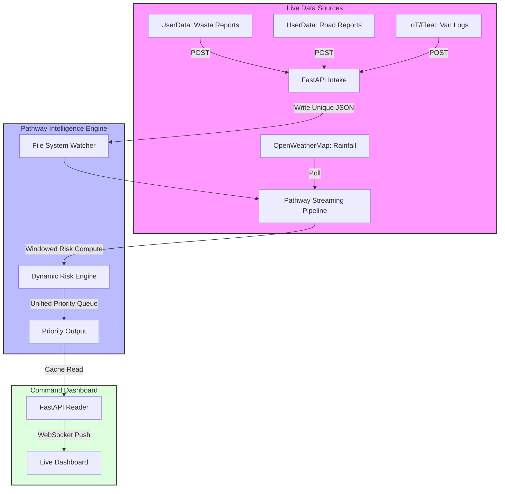

# 🌿 InfraWatch Nexus — Hack for Green Bharat 2026


> **A Real-Time Municipal Intelligence Engine**
> Transforming fragmented civic reports into actionable, prioritized waste & road operations.

---

## 📊 The "Why"

Municipal operations are reactive. We make them **Predictive & Prioritized**.
Instead of a static list of complaints, InfraWatch Nexus uses a **Streaming RISC Engine** to dynamically score and rank every ward in Delhi based on live data.

---

## 🏗 Architecture Infographic



---

## 🚀 Key Features

### 1. Dual-Risk Scoring Engine
We don't just count reports. We **weigh** them.
- **Waste Risk (70%)**: Overflow Severity × Frequency × Collection Delay
- **Road Risk (30%)**: Severity × Density × Weather Impact
- *Result*: A "Critical" waste situation always outranks a "Warning" road issue.

### 2. Resilient Data Pipeline
- **No Simulators**: Real HTTP intake.
- **Zero Data Loss**: Unique JSON file generation for every event.
- **Offline Capable**: Works even if weather API fails (graceful degradation).

---

## 🛠 Tech Stack

| Component | Technology | Role |
| :--- | :--- | :--- |
| **Streaming Core** | **Pathway** | The brain. Handles windows, joins, and risk math. |
| **API Layer** | **FastAPI** | High-performance async intake & WebSocket push. |
| **Frontend** | **Vanilla JS + Leaflet** | Lightweight, dependency-free dashboard. |
| **Environment** | **WSL + Docker** | Enterprise-grade deployment readiness. |

---

## 📦 Installation

```bash
# 1. Clone
git clone https://github.com/gintama1018/HACK-FOR-GREEN-BHARAT-HACKATHON.git
cd HACK-FOR-GREEN-BHARAT-HACKATHON

# 2. Setup Env
python -m venv venv
source venv/bin/activate
pip install -r requirements.txt

# 3. Configure
echo "OPENWEATHER_API_KEY=your_key" > .env

# 4. Run
# Terminal 1 (Pathway):
wsl -- python3 pathway_engine.py

# Terminal 2 (API):
python -m api.server
```

---

## 📸 Dashboard Preview

*(Add screenshots here)*

---

*Crafted with ❤️ for a Greener Bharat.*
