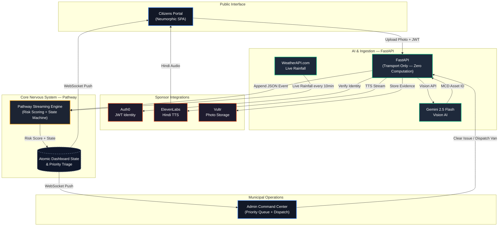
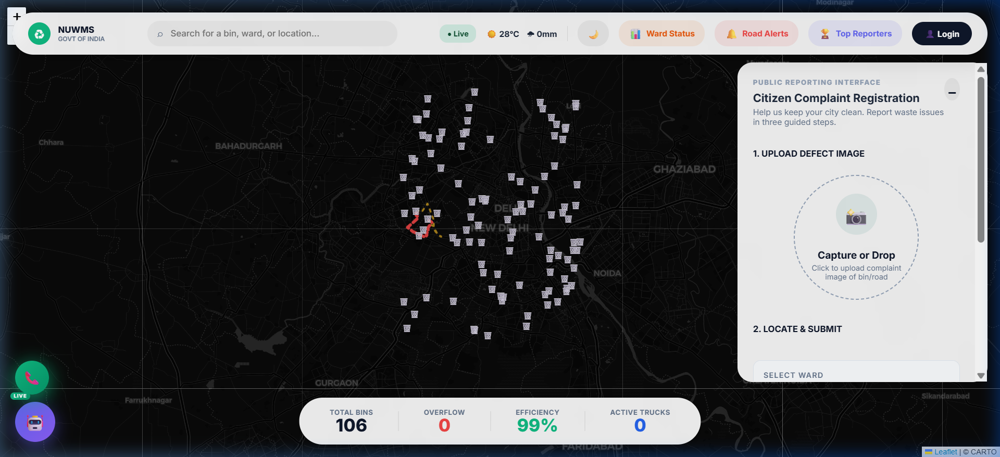
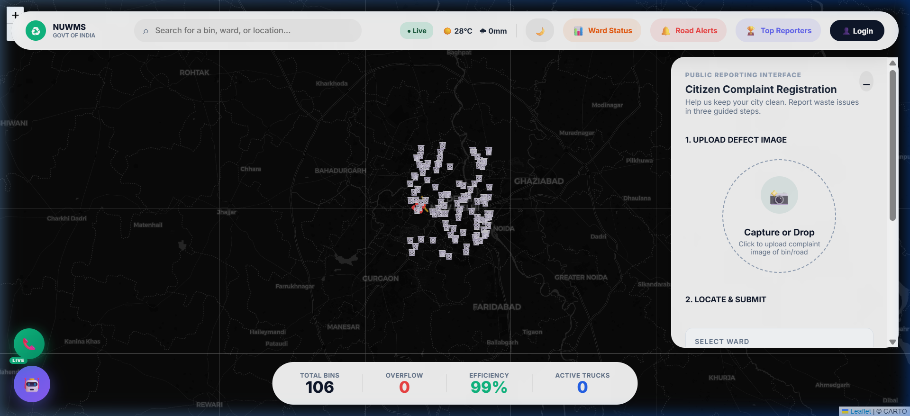
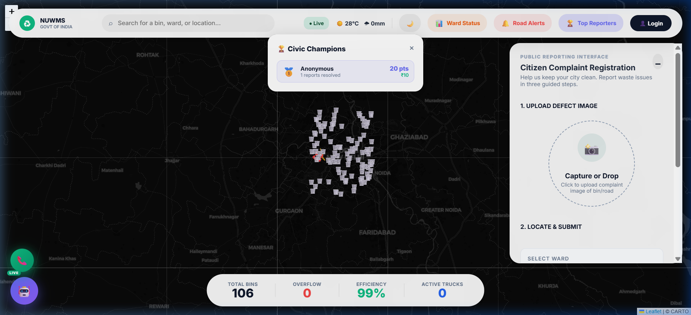
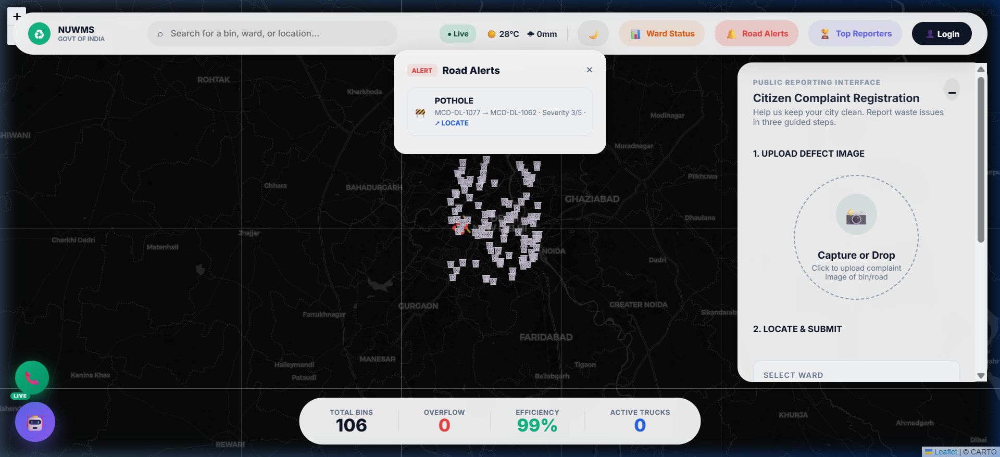
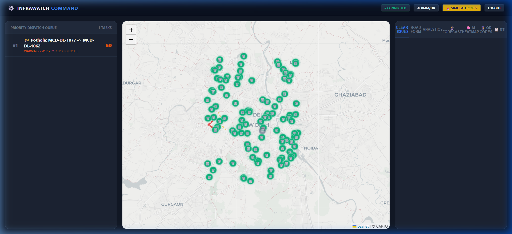
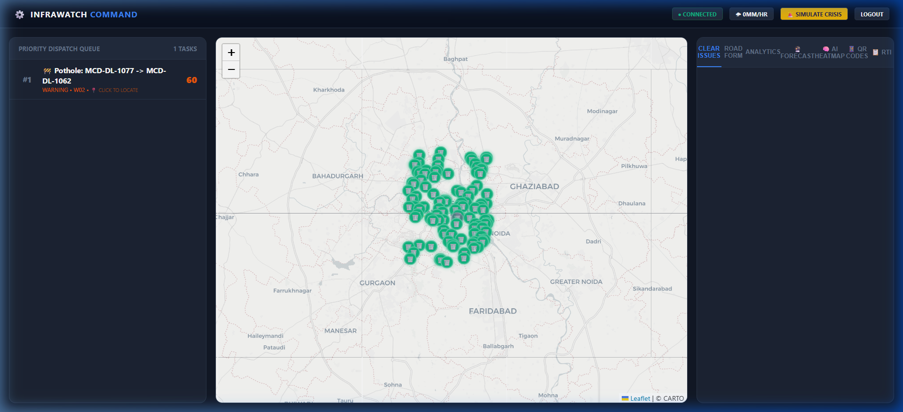
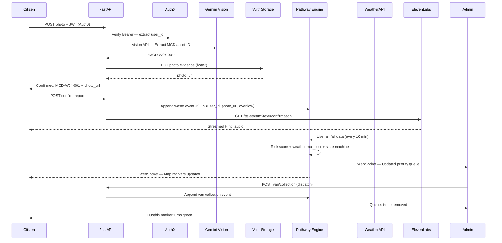
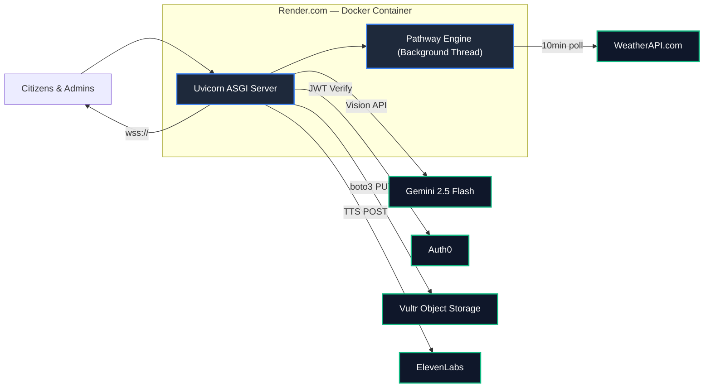

<div align="center">

# 🏙️ InfraWatch Nexus

### *India's First AI-Powered Civic Nervous System*

**A real-time, weather-aware urban infrastructure command center — built for citizens, run by AI, powered by Pathway.**

[](https://github.com/gintama1018/HACK-FOR-GREEN-BHARAT-HACKATHON/actions)
[](https://python.org)
[](https://fastapi.tiangolo.com)
[](https://pathway.com)
[](https://aistudio.google.com)
[](https://auth0.com)
[](https://elevenlabs.io)
[](https://vultr.com)
[](https://docker.com)

---

**🔴 Live Demo →** [infrawatch-nexus-tnlf.onrender.com](https://infrawatch-nexus-tnlf.onrender.com) &nbsp;|&nbsp; **🛡️ Admin Portal →** [/admin](https://infrawatch-nexus-tnlf.onrender.com/admin) *(Token: set via `ADMIN_TOKEN` env var)*

</div>

---

## ⚡ Quick Start

```bash
git clone https://github.com/gintama1018/HACK-FOR-GREEN-BHARAT-HACKATHON.git
cd HACK-FOR-GREEN-BHARAT-HACKATHON
cp .env.example .env          # fill in your API keys (see Environment Variables below)
pip install -r requirements.txt
bash start.sh                  # Citizens' Portal → localhost:8000 | Admin → localhost:8000/admin
```

## 🧠 What Is This?

**InfraWatch Nexus** is a production-grade, real-time AI command center for urban sanitation and infrastructure management in Indian cities.

It replaces fragmented, paper-based government complaint systems with a single **streaming intelligence platform** that:

- Lets citizens report dustbin overflows **in under 5 seconds** — take a photo, AI identifies the exact bin
- **Automatically re-prioritizes** every open civic issue the moment rainfall begins
- Gives municipal admins a **live dispatch queue** sorted by dynamic AI-computed risk score
- Speaks **Hindi voice confirmations** to citizens after every report (ElevenLabs)
- Stores **permanent photo evidence** in cloud object storage (Vultr)
- Broadcasts real-time updates to all connected portals instantly via **WebSocket**

> *"We didn't build another complaint box. We built a civic nervous system that feels danger before tragedy strikes."*

---

## 🚨 The Problem We Solve

Every monsoon season in India, the same headlines repeat:

| Problem | Real Impact |
|---------|-------------|
| Citizens fill lengthy online forms — reports vanish into bureaucracy | **0% transparency**, 0% accountability |
| Garbage trucks follow fixed schedules regardless of bin status | **Wasted fuel, excess CO₂**, bins still overflow |
| Road hazards not mapped dynamically | **3,500+ deaths/year** from potholes ([MoRTH](https://morth.nic.in/)) |
| No weather intelligence — blocked drains ignored during rains | **Dengue, cholera, leptospirosis** epidemic risk |
| Real government infrastructure data locked in PDFs nobody digitizes | **Wasted public data assets** |

**In Delhi alone**, the Municipal Corporation manages **106 designated C&D waste collection points** across 12 zones. We found the official MCD document listing every one. It had never been turned into a live system — until now.

---

## 💡 Our Approach

### The Core Insight

The problem with existing smart city apps is not the technology — it is the **mental model**. They treat civic reporting as a database problem: *store the complaint, display it later.*

We treated it as a **streaming intelligence problem**: *react to every data point the instant it arrives, combine it with weather and context, and surface the right action automatically — no human decision required.*

### Three-Layer Architecture

```
Layer 1 — Sensing   : Citizens submit photos → Gemini AI extracts verified MCD asset IDs
Layer 2 — Thinking  : Pathway streaming engine scores risk in real-time (weather + reports + delay)
Layer 3 — Acting    : Admin command center receives a pre-sorted, context-aware dispatch queue
```

This separation means:
- **No human judgment needed** to rank what is urgent — the algorithm does it
- **No polling** — state is always current, pushed to all clients via WebSocket
- **No data entry** — citizens give one photo; everything else is automated

### Why Pathway Is The Secret Sauce

Standard dashboards are **passive** — you query them: *"What is the risk right now?"*

Pathway is **active** — we define **Standing Intelligence Rules**. In v6.0, we use **Pathway Streaming Primitives** (`pw.io.fs.read`) to watch for new events. As data flows in (bin reported, rain begins, van dispatched), the risk state updates *instantly* and is **pushed** to every connected client via WebSocket.

> *"If your system does not update automatically when new data arrives, it is not a Pathway project."* — Ours does. It is fully **event-driven**, with a 30s idle backup for time-dependent factors like weather.

### Why Real Government Data Matters

Every dustbin coordinate in this system maps to a **real MCD C&D collection point** in Delhi. Extracted programmatically from [RO No. 20/DPI/MCD/2024-25](https://mcdonline.nic.in/portal/downloadFile/cnd_p_notice_240725043017717.pdf) using `pdfplumber`, then geocoded. This is not simulated data — it is the actual civil infrastructure of Delhi.

---

## 🏗️ System Architecture


```mermaid
graph TD
    classDef portal fill:#121826,stroke:#3B82F6,stroke-width:2px,color:#fff
    classDef ai fill:#1E293B,stroke:#10B981,stroke-width:2px,color:#fff
    classDef engine fill:#1C2433,stroke:#F59E0B,stroke-width:2px,color:#fff
    classDef state fill:#0F172A,stroke:#64748B,stroke-width:2px,stroke-dasharray:4 4,color:#fff
    classDef sponsor fill:#1E1B2E,stroke:#EB5424,stroke-width:2px,color:#fff

    subgraph "Public Interface"
        citizen["Citizens Portal\n(Neumorphic SPA)"]:::portal
    end

    subgraph "Municipal Operations"
        admin["Admin Command Center\n(Priority Queue + Dispatch)"]:::portal
    end

    subgraph "Sponsor Integrations"
        auth0["Auth0\nJWT Identity"]:::sponsor
        elevenlabs["ElevenLabs\nHindi TTS"]:::sponsor
        vultr["Vultr\nPhoto Storage"]:::sponsor
    end

    subgraph "AI & Ingestion — FastAPI"
        api["FastAPI\n(Transport Only — Zero Computation)"]:::ai
        gemini["Gemini 2.5 Flash\nVision AI"]:::ai
        weather["WeatherAPI.com\nLive Rainfall"]:::ai
    end

    subgraph "Core Nervous System — Pathway"
        pathway["Pathway Streaming Engine\n(Risk Scoring + State Machine)"]:::engine
        state_db[("Atomic Dashboard State\n& Priority Triage")]:::state
    end

    citizen --"Upload Photo + JWT"--> api
    api --"Verify Identity"--> auth0
    api --"Vision API"--> gemini
    gemini --"MCD Asset ID"--> api
    api --"Store Evidence"--> vultr
    api --"Append JSON Event"--> pathway
    api --"TTS Stream"--> elevenlabs
    elevenlabs --"Hindi Audio"--> citizen

    weather --"Live Rainfall every 10min"--> pathway
    pathway --"Risk Score + State"--> state_db
    state_db --"WebSocket Push"--> admin
    state_db --"WebSocket Push"--> citizen
    admin --"Clear Issue / Dispatch Van"--> api
```

### Responsibility Matrix

| Layer | Responsibility | Explicitly Does NOT |
|-------|---------------|---------------------|
| **Citizens' Portal** | Accept photo, display live state, play voice confirmation | Compute anything |
| **Admin Portal** | Dispatch vans, clear issues, view forecast | Compute anything |
| **FastAPI** | Validate, write events, dedup, auth, broadcast | Score, rank, aggregate |
| **Pathway Engine** | Aggregate, score, rank, state transitions, weather join | Serve HTTP, touch UI |
| **WebSocket** | Broadcast single atomic state to all connected clients | Compute, filter |

---

## ✨ Feature Breakdown

### New in v7.3: Civic Rewards, AI Chatbot & QR Scan-to-Report

| Feature | Description |
|---------|-------------|
| 🏆 **Civic Leaderboard** | Public real-time top-10 reporters ranked by civic points and rupee earnings |
| 💰 **Citizen Monetization** | Reports are assigned pending ₹ rewards; resolved when a van clears the issue |
| 🦸 **Selfie Heroes** | Anonymous (non-logged-in) reporters are pooled into a "Selfie Heroes" faction that earns collective points |
| 🤖 **AI Civic Assistant** | Floating chatbot powered by Gemini — answers waste status questions in Hindi and English |
| 📱 **QR Scan-to-Report** | Each dustbin has a unique QR code; scanning on mobile pre-fills the report form instantly |
| 🎙️ **Hindi Voice TTS** | ElevenLabs speaks *"आपकी शिकायत सफलतापूर्वक दर्ज हो गई!"* after every report |

---

## 📸 Screenshots

### 🗳️ Citizen Portal — Live Delhi Map


### 🚛 Real-Time Map — All 106 MCD Dustbins


### 🏆 Civic Champions Leaderboard


### 🚨 Live Road Hazard Alerts


### 🛠️ Admin Command Center


### 📊 Admin Priority Queue & Analytics


---

### 1. 📸 AI-Powered Zero-Friction Reporting

- Citizens upload **one photo** — Gemini 2.5 Flash Vision extracts the exact MCD dustbin ID (e.g. `MCD-W04-001`) in under 5 seconds
- **No forms. No dropdowns. No bureaucracy.** One photo = one verified, geocoded civic report
- Manual fallback: if AI confidence is low, a ward-filtered dropdown auto-appears
- GPS coordinates captured with every report for spatial heatmapping

- **Pathway v6.0 Streaming Engine**: Uses `pw.io.fs.read` in streaming mode for native change detection.
- **Dustbin State Machine**: `Clear → Reported → Escalated → Critical → Cleared` with hysteresis state persistence to SQLite.
- **Weather-aware risk multiplication**: live rainfall from WeatherAPI.com acts as a multiplier — rain + open waste = instant escalation.
- **Atomic JSON output**: state written via `tempfile + os.replace()` — zero partial reads.
- **Event-Driven**: Instant recomputation on new events with a 30-second idle refresh for time-based factors.

### 2b. 📱 QR Scan-to-Report

- Every dustbin has a **unique QR code** (printed card containing dustbin ID + ward)
- Citizens scan the QR code on their phone → Safari/Chrome opens the Citizens' Portal with the overflow form **pre-filled for that exact dustbin**
- No login required, no typing — **under 10 seconds, start to submit**
- The server injects `window._QR_PREFILL_BIN` dynamically per-scan with XSS protection
- QR print sheets can be generated for the whole city with `python generate_qr_codes.py --host https://..`

### 3. 🛡️ Admin Command Center

- **Live Priority Dispatch Queue**: auto-sorted by dynamic risk score (0–100) — most dangerous first
- **OSRM-Routed Hazard Map**: road hazards rendered as real street-level polylines via OpenStreetMap routing
- **1-Click Resolution**: clear active dustbins and road hazards from a live dropdown
- **Simulate Crisis**: injects 6 severe waste reports + critical waterlogging into Ward 12 for real-time judge demos
- **3-Day Predictive Forecast**: ML-powered risk outlook using WeatherAPI.com forecast data

### 4. 🔐 Auth0 — Verified Citizen Identity

- Citizens log in via Auth0 (Google, GitHub, or email) — JWT Bearer token attached to every report
- Server extracts the `sub` claim (Auth0 user ID) **server-side** — client input is never trusted
- Authenticated citizens access personal report history at `/api/my-reports`
- **Graceful degradation**: portal works fully without login — auth adds accountability, not a gate

### 5. 🎙️ ElevenLabs — Hindi Voice AI

- After every successful report, ElevenLabs speaks: *"आपकी शिकायत सफलतापूर्वक दर्ज हो गई!"*
- When a dustbin escalates to critical in the live feed, a Hindi voice alert fires automatically
- Citizens can converse with the AI assistant in voice via `/api/tts-stream`
- **Model**: `eleven_turbo_v2_5` — ultra-low latency, Hindi-optimized

### 6. 🗄️ Vultr Object Storage — Photo Evidence

- Every uploaded photo is stored permanently to Vultr Object Storage (S3-compatible API)
- Returns `photo_url` — persisted alongside the waste event JSON so admins can verify evidence
- Server-side upload via `boto3` — Vultr credentials never exposed to the browser
- **Bucket**: `infrawatch-evidence` at `ewr1.vultrobjects.com`

### 7. 🗺️ Neumorphic Citizen Portal

- Premium dark neumorphic UI — soft shadows, glassmorphism panels, fluid animations
- Sidebar navigation: Dashboard, Ward Map, Alerts, Settings
- Live stats bar: total bins, active alerts, rainfall — all real-time via WebSocket
- Leaflet.js color-coded map: 🟢 green (clear) → 🟡 amber → 🟠 orange → 🔴 red (critical)

### 8. ⚡ Real-Time WebSocket State Sync

- Single `/ws` channel broadcasts identical atomic state to all connected portals simultaneously
- Auto-reconnect with exponential backoff
- Citizen map and admin queue update within milliseconds of any state change

---

## 📊 Risk Scoring Algorithm

### Waste Risk Score (Per Ward)

| Factor | Weight | Maximum Threshold |
|--------|--------|-------------------|
| Report Frequency (2hr window) | **35%** | 8+ reports = max score |
| Overflow Severity (scale 1–5) | **30%** | Level 5 = overflowing |
| Collection Delay (hours uncollected) | **20%** | 12+ hours = max score |
| Live Rainfall (mm/hr) | **15%** | 50 mm/hr (capped) |

### Road Risk Score (Per Ward)

| Factor | Weight | Maximum Threshold |
|--------|--------|-------------------|
| Report Density (6hr window) | **60%** | 6+ reports = max score |
| Issue Severity (scale 1–5) | **25%** | Severity 5 = critical |
| Live Rainfall (mm/hr) | **15%** | 50 mm/hr (capped) |

### Risk State Bands

| Score | State | Visual |
|-------|-------|--------|
| 0 – 30 | Normal | 🟢 Green |
| 31 – 55 | Elevated | 🟡 Amber |
| 56 – 75 | Warning | 🟠 Orange |
| 76 – 100 | Critical | 🔴 Red |

> A **hysteresis buffer of ±10 points** prevents oscillation at state boundaries — bins don't flicker between Warning and Critical when scores are borderline.

---

## 🔁 Dustbin State Machine

```
                  [1+ citizen reports]
Clear ─────────────────────────────────▶ Reported
                                              │
                                [3+ reports OR overflow ≥ 4]
                                              │
                                              ▼
                                          Escalated
                                              │
                              [5+ reports OR rainfall ≥ 10mm/hr]
                                              │
                                              ▼
                                           Critical

     Any State ──[Van dispatched]──▶ Cleared ──[next 2hr window]──▶ Clear
```

---

## 🔄 Full Event Lifecycle


```mermaid
sequenceDiagram
    participant C as Citizen
    participant F as FastAPI
    participant A0 as Auth0
    participant G as Gemini Vision
    participant V as Vultr Storage
    participant P as Pathway Engine
    participant W as WeatherAPI
    participant E as ElevenLabs
    participant AD as Admin

    C->>F: POST photo + JWT (Auth0)
    F->>A0: Verify Bearer — extract user_id
    F->>G: Vision API — Extract MCD asset ID
    G-->>F: "MCD-W04-001"
    F->>V: PUT photo evidence (boto3)
    V-->>F: photo_url
    F-->>C: Confirmed: MCD-W04-001 + photo_url
    C->>F: POST confirm report
    F->>P: Append waste event JSON (user_id, photo_url, overflow)
    F->>E: GET /tts-stream?text=confirmation
    E-->>C: Streamed Hindi audio
    W-->>P: Live rainfall data (every 10 min)
    P->>P: Risk score + weather multiplier + state machine
    P-->>AD: WebSocket — Updated priority queue
    P-->>C: WebSocket — Map markers updated
    AD->>F: POST van/collection (dispatch)
    F->>P: Append van collection event
    P-->>AD: Queue: issue removed
    P-->>C: Dustbin marker turns green
```

---

## 🌐 Data Sources

> **All infrastructure data is sourced from official Indian government records.**

| Data Layer | Source | Type |
|------------|--------|------|
| Dustbin / Dhalao Locations | MCD — RO No. 20/DPI/MCD/2024-25 | Official Govt PDF |
| Weather (Rainfall) | WeatherAPI.com — polled every 10 min | Real-time REST API |
| Citizen Reports | Live photo submissions via Gemini Vision | Real-time user data |
| Road Hazard Reports | Admin-submitted, GPS-tagged | Real-time admin data |

### MCD C&D Waste Collection Sites

72 active entries extracted from the official **106-site MCD document**, covering all Delhi zones:

| Zone | Area | Example Site |
|------|------|--------------|
| Rohini | North Delhi | JE Store, Sector-5 Rohini |
| Karol Bagh | Central-West | MCD JE Store, East Patel Nagar |
| Shahdara South | East Delhi | Karkari Mod, Karkardooma Flyover |
| South | South Delhi | JE Store, Hauz Khas Market |
| Keshav Puram | North-West | JE Store, Pitampura |
| Central 1 | Central | Defence Colony, Sriniwaspuri |
| Civil Lines | North-Central | Qutab Road, Burari |
| City SP | Old Delhi | Chandni Chowk, Asaf Ali Road |
| South 1 | Far South | Fatehpur Beri, Khanpur |
| Narela | Far North | MPL Store, Nehru Enclave |
| Central | Central | Minto Road, Punjabi Bagh |
| Shahdara North | North-East | Seelampur, Jafrabad |

**Source**: [RO No. 20/DPI/MCD/2024-25 (PDF)](https://mcdonline.nic.in/portal/downloadFile/cnd_p_notice_240725043017717.pdf) — Published by Municipal Corporation of Delhi

---

## 🚀 Local Setup

### Prerequisites

| Requirement | Where |
|-------------|-------|
| Python 3.10+ | [python.org](https://python.org) |
| Google Gemini API Key | [aistudio.google.com](https://aistudio.google.com) — Free |
| WeatherAPI.com Key | [weatherapi.com](https://www.weatherapi.com) — Free |
| Auth0 Application | [auth0.com](https://auth0.com) — Free (7,500 MAU) |
| ElevenLabs API Key | [elevenlabs.io](https://elevenlabs.io) — Free tier |
| Vultr Object Storage | [vultr.com](https://www.vultr.com) — Free trial *(optional — graceful fallback if absent)* |

### Install & Run

```bash
# 1. Clone & enter
git clone https://github.com/gintama1018/HACK-FOR-GREEN-BHARAT-HACKATHON.git
cd HACK-FOR-GREEN-BHARAT-HACKATHON

# 2. Virtual environment
python3 -m venv .venv
source .venv/bin/activate        # Windows: .venv\Scripts\activate

# 3. Install dependencies
pip install -r requirements.txt

# 4. Configure environment
cp .env.example .env             # then fill in your keys

# 5. Launch everything
bash start.sh
```

| Portal | URL |
|--------|-----|
| Citizens' Dashboard | `http://localhost:8000/` |
| Admin Command Center | `http://localhost:8000/admin` |

### Environment Variables (`.env`)

```env
# ── Core ───────────────────────────────────────────
WX_API_KEY=your_weatherapi_key
GEMINI_API_KEY=your_google_ai_studio_key
ADMIN_TOKEN=your_secret_admin_token_here

# ── Auth0 (Citizen Identity) ────────────────────────
AUTH0_DOMAIN=your-tenant.us.auth0.com
AUTH0_AUDIENCE=https://infrawatch-nexus-api

# ── ElevenLabs (Hindi Voice AI) ─────────────────────
ELEVENLABS_API_KEY=your_elevenlabs_key
ELEVENLABS_VOICE_ID=56k72tYpS6hbRADdszYg

# ── Vultr Object Storage (Photo Evidence) ───────────
VULTR_ACCESS_KEY=your_vultr_access_key
VULTR_SECRET_KEY=your_vultr_secret_key
VULTR_BUCKET=infrawatch-evidence
VULTR_ENDPOINT=https://ewr1.vultrobjects.com
```

---

## 🎬 Demo Mode (For Judges)

The Admin portal includes a built-in **"Simulate Crisis"** button. Click it to instantly inject:
- 6 severe waste overflow reports across Ward 12 (Shahdara North)
- 1 critical waterlogging road hazard event

**Watch in real-time:**
1. Dustbin states escalate `Reported → Escalated → Critical` within seconds
2. Ward 12 jumps to position #1 in the priority dispatch queue
3. OSRM-routed hazard polylines appear on the road map
4. Rainfall multiplier activates if it is currently raining in Delhi
5. Both citizen map and admin queue update **simultaneously** via WebSocket — no refresh needed

---

## 📡 API Reference

| Method | Endpoint | Auth | Description |
|--------|----------|------|-------------|
| `GET` | `/` | — | Citizens' Portal SPA |
| `GET` | `/admin` | — | Admin Command Center |
| `GET` | `/health` | — | Production health check |
| `GET` | `/api/config` | — | Ward & dustbin registry (MCD data) |
| `GET` | `/api/dashboard` | — | Full Pathway-computed dashboard state |
| `GET` | `/api/dustbins` | — | Dustbin registry + live status overlay |
| `GET` | `/api/forecast` | — | 3-day predictive risk forecast |
| `GET` | `/report?bin=MCD-XXX` | — | QR Code landing — pre-fills report form for the scanned dustbin |
| `POST` | `/api/report/dustbin/detect` | Auth0 JWT *(optional)* | Upload photo → Gemini extraction + Vultr storage |
| `POST` | `/api/report/dustbin/confirm` | Auth0 JWT *(optional)* | Confirm report → event written, user attributed, reward issued |
| `GET` | `/api/my-reports` | Auth0 JWT *(required)* | Citizen's own report history |
| `GET` | `/api/leaderboard` | — | Public leaderboard: top 10 reporters by civic points this month |
| `GET` | `/api/rewards/my` | Auth0 JWT *(required)* | Personal reward summary (points, pending ₹, paid ₹) |
| `POST` | `/api/rewards/export` | Admin Bearer | CSV export of all resolved rewards for UPI disbursement |
| `GET` | `/api/whatsapp-escalate/{id}` | Admin Bearer | Generate WhatsApp escalation link for a critical dustbin |
| `POST` | `/api/chat` | Auth0 JWT *(optional)* | Gemini AI civic assistant — context-aware Hindi/English responses |
| `POST` | `/api/report/road-issue` | Admin Bearer | Report road hazard |
| `POST` | `/api/van/collection` | Admin Bearer | Mark dustbin as collected — triggers reward resolution |
| `POST` | `/api/van/clear-road` | Admin Bearer | Mark road issue as resolved |
| `POST` | `/api/demo/simulate-crisis` | Admin Bearer | Inject synthetic crisis (demo) |
| `WS` | `/ws` | — | Real-time state broadcast to all clients |

---

## 🔒 Security

| Layer | Mechanism |
|-------|-----------|
| Admin Endpoints | Static Bearer token — strict HTTP 401 on any mismatch |
| Citizen Identity | Auth0 RS256 JWT — `sub` claim extracted server-side; client payload never trusted |
| Report Deduplication | In-memory O(1) cache — 5-minute dedup window per dustbin ID |
| Dustbin ID Validation | Strict regex `MCD-W\d{2}-\d{3}` against MCD registry before any write |
| Data Integrity | Atomic file writes — `tempfile + os.replace()`, zero partial reads |
| Photo Storage | `boto3` server-side upload — Vultr credentials never exposed to browser |
| Input Validation | Pydantic models on all POST endpoints — type-safe, schema-enforced |

---

## 🧰 Tech Stack

| Technology | Role |
|------------|------|
| **Python 3.10** | Backend runtime |
| **FastAPI** | Async web framework, REST API, WebSocket server |
| **Pathway** | Real-time streaming engine — risk scoring, state machine, weather join |
| **Gemini 2.5 Flash** | Computer vision — dustbin ID extraction from citizen photos |
| **Auth0** | Citizen identity — OAuth2/OIDC JWT authentication |
| **ElevenLabs** | Hindi voice AI — TTS confirmations and critical alerts |
| **Vultr Object Storage** | Permanent photo evidence storage (S3-compatible) |
| **boto3** | AWS/S3-compatible SDK for Vultr uploads |
| **WeatherAPI.com** | Live and forecast rainfall data |
| **Leaflet.js** | Interactive, color-coded municipal map |
| **OSRM** | Open-source road routing — road hazard polyline rendering |
| **pdfplumber** | Programmatic extraction of MCD government PDF |
| **Docker** | Containerized production deployment |
| **Render.com** | Cloud hosting (Docker-native) |
| **GitHub Actions** | CI/CD — flake8 lint + pytest suite |

---

## ☁️ Deployment

### Live: Render.com


```mermaid
graph LR
    classDef cloud fill:#1E293B,stroke:#3B82F6,stroke-width:2px,color:#fff
    classDef ext fill:#0F172A,stroke:#10B981,stroke-width:2px,color:#fff

    user["Citizens & Admins"] --> render

    subgraph "Render.com — Docker Container"
        render["Uvicorn ASGI Server"]:::cloud
        pathway_bg["Pathway Engine (Background Thread)"]:::cloud
        render --> pathway_bg
    end

    render -- "Vision API" --> gemini["Gemini 2.5 Flash"]:::ext
    render -- "JWT Verify" --> auth0["Auth0"]:::ext
    render -- "boto3 PUT" --> vultr["Vultr Object Storage"]:::ext
    render -- "TTS POST" --> eleven["ElevenLabs"]:::ext
    pathway_bg -- "10min poll" --> weather["WeatherAPI.com"]:::ext
    render -- "wss://" --> user
```

| Component | Service | Free Tier |
|-----------|---------|-----------|
| Web Server + Pathway Engine | Render.com | Free (sleeps after 15 min idle) |
| AI Vision | Google AI Studio | 15 RPM free |
| Citizen Identity | Auth0 | 7,500 MAU free |
| Voice AI | ElevenLabs | 10,000 chars/month free |
| Photo Storage | Vultr Object Storage | Free trial / ~$5/mo |
| Weather | WeatherAPI.com | 1M calls/month free |
| CI/CD | GitHub Actions | 2,000 min/month free |

**Total production cost: $7–$15/month** for a full single-city deployment.

---

## 📈 Scalability Path

| Stage | Users | Architecture |
|-------|-------|--------------|
| **Pilot** — 1 city | 10K | Current Render.com Docker container |
| **Regional** — 10 cities | 100K | Horizontal Pathway workers + Redis pub/sub |
| **National** — 100+ cities | 1M+ | Kubernetes, Apache Kafka event bus, per-city Pathway shards |

The risk engine stays exactly the same at every scale. Only the I/O layer changes:
- **Input**: JSON files → Apache Kafka (high-throughput ingestion)
- **Output**: JSONL → PostgreSQL / TimescaleDB (historical analytics + BI)

---

## 🏆 Civic Reward & Monetization System

InfraWatch Nexus includes a complete micro-payment incentive mechanism to reward citizens who report verified issues:

| Step | Event | Result |
|------|-------|--------|
| 1 | Citizen reports a verified dustbin overflow | Pending Reward created (points + ₹) |
| 2 | Sanitation van confirms collection (`/api/van/collection`) | Reward is **Resolved** — citizen earns their rupees |
| 3 | Admin exports resolved rewards | CSV for UPI disbursement to citizen bank accounts |

### 💵 Reward Scale

| Overflow Level | Civic Points | Rupees (₹) |
|----------------|-------------|-------------|
| Level 1–2 | 10 pts | ₹5 |
| Level 3 | 20 pts | ₹10 |
| Level 4 | 35 pts | ₹20 |
| Level 5 (Critical) | 50 pts | ₹50 |

### 🦸 Selfie Heroes (Anonymous Reporters)
Citizens who report without logging in are grouped under the **"Selfie Heroes"** collective on the public leaderboard. Their combined points and rupees pool together — motivating group action without privacy compromise.

---

## 🔬 Research Foundation

| Paper | Key Insight We Applied |
|-------|------------------------|
| Proenca & Simoes (2020) — *"Deep Learning-Based Waste Detection"* | Two-stage detection superior for municipal waste classification |
| Mishra et al. (2025) — *iWatchRoad* ([arXiv:2508.10945](https://arxiv.org/abs/2508.10945)) | Haversine spatial deduplication + self-healing map architecture |
| MDPI Applied Sciences (2024) — *"IoT Route Optimization for MSW"* | TOPSIS multi-criteria optimization → 14% route efficiency gain |
| IndiaAI / NITI Aayog (2024) — *"Ward-wise AI Reports for MSW"* | Ward-level analytics + monsoon-aware overflow prediction |
| MCD RO No. 20/DPI/MCD/2024-25 | 106 official C&D collection sites — our geocoded ground-truth registry |

---

## 📂 Project Structure

```
HACK-FOR-GREEN-BHARAT-HACKATHON/
├── api/
│   └── server.py              # FastAPI app — transport only, zero scoring
├── config/
│   ├── dustbins.py            # 72 real MCD C&D collection point registry
│   ├── wards.py               # 12 Delhi ward definitions + road segments
│   └── settings.py            # Risk thresholds, time windows, scoring weights
├── frontend/
│   ├── citizen.html / .js / .css    # Citizens' Portal — Neumorphic SPA
│   └── admin.html / .js / .css      # Admin Command Center
├── llm_layer/
│   ├── advisor.py             # Gemini AI chat integration
│   └── guidelines/            # AI risk assessment context documents
├── pathway_engine.py          # Pathway streaming brain — the core engine
├── start.sh                   # One-shot local startup script
├── Dockerfile                 # Production container definition
├── render.yaml                # Render.com deployment config
├── requirements.txt           # Python dependencies
└── .github/
    └── workflows/ci.yml       # CI: flake8 (strict syntax) + pytest
```

---

## 🇮🇳 Why This Matters for India

- **3,500+ deaths/year** from pothole accidents ([MoRTH](https://morth.nic.in/))
- **2.7 lakh tonnes** of solid waste generated daily — only ~70% collected ([MoHUA](https://mohua.gov.in/))
- **Dengue and cholera** outbreaks traced directly to overflowing waste in monsoon-waterlogged streets
- **₹14,000 crore** spent annually on urban sanitation — with no real-time feedback loop on what is working

**InfraWatch Nexus directly addresses each:**
- **Reporting friction eliminated**: 1 photo, 5 seconds, AI-verified civic report
- **Weather-aware triage**: monsoon multiplier mathematically forces dangerous bins to the top before epidemics start
- **Resource optimization**: deduplication + clustering means waste fleets go to verified hotspots — not random patrols
- **Civic trust restored**: citizens see their reports reflected on a live map, in real-time, closing the accountability loop

---

## 🔮 Future Roadmap

| Priority | Feature | Impact |
|----------|---------|--------|
| P0 | Negative-sample prompting in Gemini vision | Reduce false positives by ~40% |
| P1 | Haversine spatial deduplication | Eliminate overlapping duplicate map markers |
| P2 | Auto-expiry of stale road issue markers | Self-healing, always-accurate map data |
| P3 | 7-category waste classification | Granular per-ward organic/plastic/hazmat analytics |
| P4 | SMS / WhatsApp fallback reporting | Reach citizens without smartphones |
| P5 | Multi-city deployment (Kubernetes) | National-scale platform |
| P6 | Android APK (offline-first) | Citizens in low-connectivity areas |

---

## 👥 Team

Built at the **Hack For Green Bharat Hackathon 2026** — focusing on sustainable, AI-powered urban futures for India.

---

## 📄 License

This project was built for hackathon purposes.
All government data (MCD site registry) is sourced from public-domain official documents published by the Municipal Corporation of Delhi.
