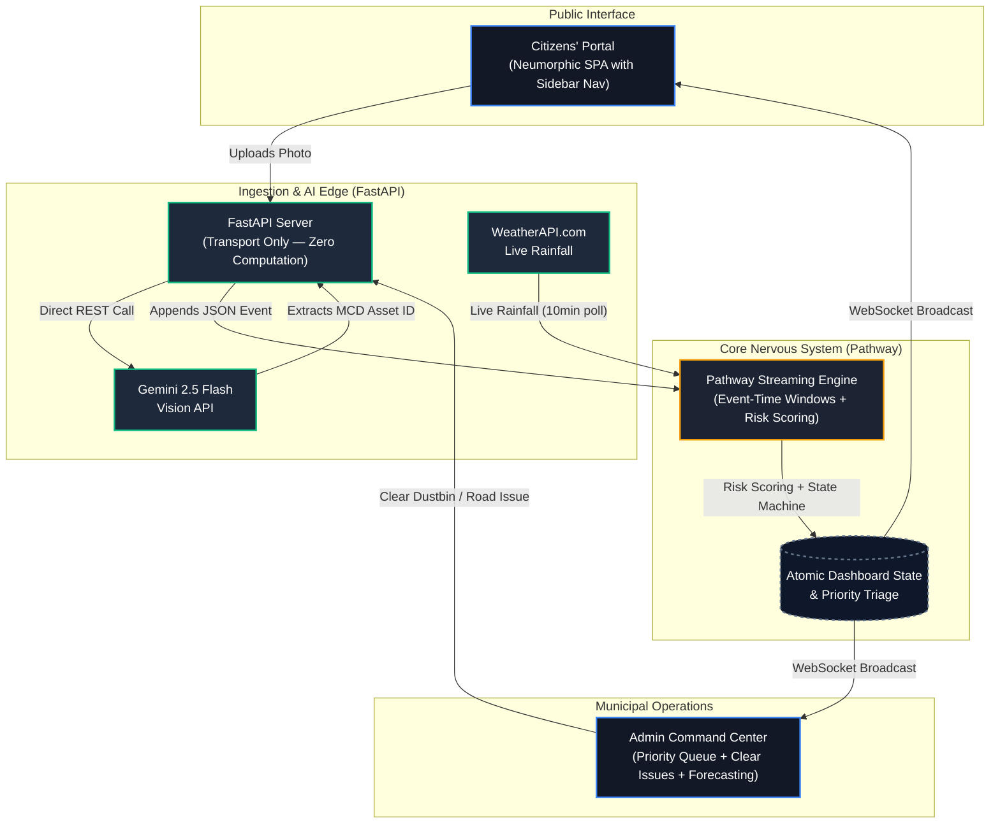
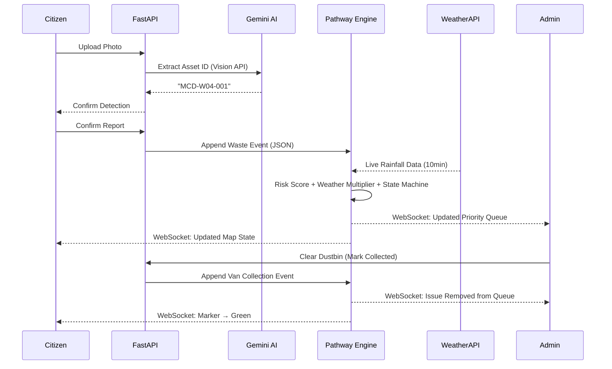
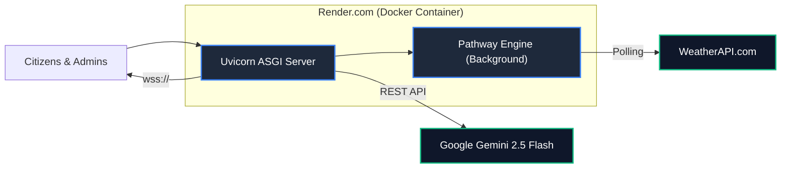

# InfraWatch Nexus 🏙️


**InfraWatch Nexus** is a production-grade, real-time AI command center for urban sanitation and infrastructure management. It connects citizens directly to municipal dispatch operations through streaming event architecture, computer vision AI, and live weather-aware risk scoring.

> **Live Demo:** [https://infrawatch-nexus-tnlf.onrender.com](https://infrawatch-nexus-tnlf.onrender.com)
> **Admin Portal:** [/admin](https://infrawatch-nexus-tnlf.onrender.com/admin) (Token: `INFRAWATCH_ADMIN_2026`)

### Sponsor Integrations
| Partner | Integration |
|---------|-------------|
| **Auth0** | Citizen identity — JWT-secured reporting, user history via `/api/my-reports` |
| **ElevenLabs** | Hindi voice AI — real-time TTS confirmations and critical ward alerts |
| **Vultr** | Object Storage — photo evidence from every citizen report stored permanently |

### Quickstart — Run in 3 Commands

```bash
git clone https://github.com/gintama1018/HACK-FOR-GREEN-BHARAT-HACKATHON.git
cp .env.example .env   # Add your GEMINI_API_KEY and WX_API_KEY
bash start.sh           # Citizens' Portal at localhost:8000 | Admin at localhost:8000/admin
```

---

## The Origin Story — Why We Built This

> *"We didn't start with code. We started with frustration."*

Every monsoon season, the same headlines repeat across India — overflowing garbage bins breeding disease, potholes swallowing motorcycles, waterlogged intersections turning into death traps. Every year, **3,500+ people die** from pothole-related road accidents alone ([MoRTH](https://morth.nic.in/)). Every year, citizens file thousands of complaints that disappear into bureaucratic black holes. Every year, the government promises "smart city" solutions — and delivers another static complaint portal that nobody uses.

We saw this cycle firsthand. In Delhi, the Municipal Corporation manages **106 designated waste collection points** across 12 zones. These "dhalaos" — open collection spots — regularly overflow during monsoons, becoming breeding grounds for dengue and cholera. The data existed (we found the official MCD PDF listing every single site), but it sat locked in a government document that nobody had ever turned into a living, breathing system.

### The Moment It Clicked

During the **Hack For Green Bharat Hackathon**, we were introduced to the **Pathway streaming engine** — a real-time data processing framework that reacts to changes the instant they happen. Not batch jobs. Not database queries. *Instant reaction.*

That's when the lightbulb went off:

**What if the city itself could think?**

Not a dashboard that you *check*. A nervous system that *feels*. One that knows when garbage is piling up, knows it's about to rain, and automatically pushes the most dangerous situation to the top of the dispatch queue — before tragedy strikes.

We named it **InfraWatch Nexus** — because it sits at the nexus of citizen reports, weather data, and civic action.

### What Makes This Different

Most hackathon dashboards are just pretty front-ends for static data. We built something fundamentally different:

1. **Citizens don't fill forms.** They take a photo. AI does the rest. Under 5 seconds.
2. **The system doesn't wait to be asked.** Pathway watches all incoming data and updates risk scores in real-time. When it starts raining, every open waste pile in the city gets automatically re-prioritized.
3. **It uses real government data.** Not mock data. Not placeholder coordinates. We programmatically extracted 72 actual MCD collection points from an official RO document and geocoded every one.
4. **The architecture is production-ready.** Not a prototype. The same code runs locally and on our live deployment at Render.com for under $15/month.

> *"The goal is not to build another complaint box. The goal is to build a civic nervous system that feels danger before tragedy strikes."*

---

## Data Sources & Credibility

> **All infrastructure data in this project is sourced from official government records.**

| Data Layer | Source | Type |
|------------|--------|------|
| **Dustbin / Dhalao Locations** | **Municipal Corporation of Delhi (MCD)** — RO No. 20/DPI/MCD/2024-25 | Official Government PDF |
| **Weather (Rainfall)** | **WeatherAPI.com** — Live polling every 10 min | Real-time API |
| **Citizen Reports** | **Live user submissions** — AI-analyzed via Gemini Vision | Real-time user data |
| **Road Hazard Reports** | **Admin-submitted** — GPS-tagged between MCD collection points | Real-time admin data |

### MCD C&D Waste Collection Sites

The 72-point dustbin registry (`config/dustbins.py`) is built from the official MCD document listing **106 designated C&D (Construction & Demolition) waste collection sites** across all Delhi zones.

**Source Document:** [RO No. 20/DPI/MCD/2024-25 (PDF)](https://mcdonline.nic.in/portal/downloadFile/cnd_p_notice_240725043017717.pdf)
**Published by:** Municipal Corporation of Delhi (mcdonline.nic.in)

Data was **extracted programmatically** using `pdfplumber` and **geocoded for spatial analysis** using verified Delhi GPS coordinates. Each entry maps to a real JE Store or designated MCD collection point.

**MCD Zones Covered:**

| Zone | Area | Example Site |
|------|------|-------------|
| Rohini | North Delhi | JE Store, Sector-5 Rohini |
| Karol Bagh | Central-West | MCD JE Store, East Patel Nagar |
| Shahdara South | East Delhi | Karkari Mod, Karkardooma Flyover |
| South | South Delhi | JE Store, Hauz Khas Market |
| Keshav Puram | North-West | JE Store, Pitampura |
| Central 1 | Central | Defence Colony, Sriniwaspuri |
| Civil Lines | North-Central | Qutab Road, Burari |
| City SP | Old Delhi | Chandni Chowk, Asaf Ali Road |
| South 1 | Far South | Fatehpur Beri, Khanpur |
| Narela | Far North | MPL Store, Nehru Enclave |
| Central | Central | Minto Road, Punjabi Bagh |
| Shahdara North | North-East | Seelampur, Jafrabad |

---

## The Problem We Solve

Traditional municipal reporting is **reactive, fragmented, and blind**:

| Problem | Impact |
|---------|--------|
| Citizens fill lengthy complaint forms, reports lost in bureaucracy | **0% transparency** |
| Garbage trucks follow static schedules even when bins are empty | **Wasted fuel, higher emissions** |
| Road hazards (potholes, waterlogging) aren't mapped dynamically | **3,500+ deaths/year** ([MoRTH](https://morth.nic.in/)) |
| No weather integration — blocked drains become health emergencies during rain | **Epidemic risk** |

**InfraWatch Nexus replaces all of this** with a single AI-powered, weather-aware, real-time command center.

---

## System Architecture


```mermaid
graph TD
    classDef portal fill:#121826,stroke:#3B82F6,stroke-width:2px,color:#fff
    classDef ai fill:#1E293B,stroke:#10B981,stroke-width:2px,color:#fff
    classDef engine fill:#1C2433,stroke:#F59E0B,stroke-width:2px,color:#fff
    classDef state fill:#0F172A,stroke:#64748B,stroke-width:2px,stroke-dasharray: 4 4,color:#fff

    subgraph "Public Interface"
        citizen["Citizens' Portal<br>(Neumorphic SPA with Sidebar Nav)"]:::portal
    end

    subgraph "Municipal Operations"
        admin["Admin Command Center<br>(Priority Queue + Clear Issues + Forecasting)"]:::portal
    end

    subgraph "Ingestion & AI Edge (FastAPI)"
        api["FastAPI Server<br>(Transport Only — Zero Computation)"]:::ai
        gemini["Gemini 2.5 Flash<br>Vision API"]:::ai
        weather["WeatherAPI.com<br>Live Rainfall"]:::ai
    end

    subgraph "Core Nervous System (Pathway)"
        pathway["Pathway Streaming Engine<br>(Event-Time Windows + Risk Scoring)"]:::engine
        state_db[("Atomic Dashboard State<br>& Priority Triage")]:::state
    end

    citizen --"Uploads Photo"--> api
    api --"Direct REST Call"--> gemini
    gemini --"Extracts MCD Asset ID"--> api
    api --"Appends JSON Event"--> pathway

    weather --"Live Rainfall (10min poll)"--> pathway

    pathway --"Risk Scoring + State Machine"--> state_db
    state_db --"WebSocket Broadcast"--> admin
    state_db --"WebSocket Broadcast"--> citizen

    admin --"Clear Dustbin / Road Issue"--> api
```

### Why Pathway? (The Secret Sauce)

Most dashboards use passive databases — you have to *ask* them for information. Pathway is fundamentally different:

1. **Standard Databases are Passive:** You query them: "What's the risk right now?"
2. **Pathway is Active:** We define **Standing Intelligence Rules**. As data flows in (rain starts, a truck is delayed), the risk score updates *instantly*.
3. **Result:** The system is always up-to-date. We don't query for risk — the risk state is *pushed* to all connected clients.

> **One-line rule from the hackathon:** *"If your system does not update automatically when new data arrives, it is not a Pathway project."* — Ours does.

### Responsibility Matrix

| Layer | Does | Does NOT |
|-------|------|----------|
| **Citizens' Portal** | Accept photo, show confirmation, display live state | Compute anything |
| **Admin Portal** | Report road issues, dispatch vans, clear infrastructure, forecast risk | Compute anything |
| **FastAPI** | Validate, write events, dedup, auth, broadcast | Score, rank, aggregate |
| **Pathway** | Aggregate, score, rank, state transitions, weather join | Serve HTTP, touch frontend |
| **WebSocket** | Broadcast single atomic state to all clients | Compute, filter |

---

## Feature Set

### 1. AI-Powered Citizen Reporting (Zero Friction)
- **Gemini 2.5 Flash Vision**: Citizens upload a single photo — AI instantly extracts the exact MCD dustbin ID (e.g., `MCD-W04-001`)
- **Zero friction**: No forms, no dropdowns. One photo = one verified report
- **Manual fallback**: If AI fails, citizen gets a ward-filtered dropdown for manual selection
- **Geolocation**: GPS coordinates captured with every report for spatial analysis

### 2. Pathway Streaming Engine (The Brain)
- **Event-time windowing**: 2-hour rolling windows for waste reports, 6-hour for road issues
- **Dustbin State Machine**: `Clear → Reported → Escalated → Critical → Cleared`
- **Weather-aware risk scoring**: Live rainfall from WeatherAPI.com acts as a multiplier — rain + open waste = instant escalation
- **Atomic JSON output**: Dashboard state written via temp-file + `os.replace()` — zero partial reads
- **3-second recompute loop**: Dashboard always reflects the latest state

### 3. Admin Command Center
- **Live Priority Dispatch Queue**: Auto-sorted by dynamic risk score (0–100)
- **Interactive OSRM-Routed Map**: Road hazards rendered as real street-level polylines via OpenStreetMap routing
- **Clear Issues Panel**: 1-click resolution of dustbins and road hazards with live dropdown of active issues
- **Simulate Crisis**: Demo button injects severe events into Ward 12 for live judge demonstration
- **Predictive Risk Forecasting**: ML-powered 3-day risk prediction using weather forecast data

### 4. Auth0 Citizen Identity
- **JWT Authentication**: Citizens log in with Auth0 (social or email) — Bearer tokens attached to every report
- **Verified Reports**: Each submission is linked to a real Auth0 user identity (`sub` claim)
- **Report History**: Authenticated citizens can view their own past submissions via `/api/my-reports`
- **Graceful Offline Mode**: Portal fully functional without login; auth enhances accountability

### 5. ElevenLabs Hindi Voice AI
- **Report Confirmation**: After submitting a report, ElevenLabs speaks a Hindi confirmation: *"आपकी शिकायत सफलतापूर्वक दर्ज हो गई!"*
- **Critical Ward Alerts**: When a dustbin escalates to Priority ≥ 3 in the live feed, ElevenLabs announces it in Hindi
- **AI Chat Voice**: The citizen AI assistant (`/api/chat`) can respond via voice using the TTS stream endpoint
- **Model**: `eleven_turbo_v2_5` — low-latency, Hindi-optimized

### 6. Vultr Object Storage — Photo Evidence
- **Permanent Storage**: Every citizen photo uploaded during AI scan is stored to Vultr Object Storage (S3-compatible)
- **Public URL**: The `photo_url` is persisted in the waste event JSON alongside the report
- **Bucket**: `infrawatch-evidence` at `ewr1.vultrobjects.com`
- **boto3 Integration**: Standard S3 API with `ACL=public-read` for fast media delivery

### 7. Neumorphic Citizen Portal
- **Modern Neumorphic UI**: Soft shadows, glassmorphism panels, premium dark theme
- **Sidebar Navigation**: Dedicated pages for Dashboard, Wards, Alerts, and Settings
- **Live Statistics Bar**: Real-time counters for total bins, active alerts, and rain status
- **Interactive Map**: Leaflet.js with color-coded dustbin markers and clustered road hazard routes

### 8. Real-Time WebSocket Sync
- Single WebSocket channel broadcasts identical atomic state to all connected portals
- Auto-reconnect with exponential backoff
- Both Citizens' and Admin maps update simultaneously within milliseconds

### 9. Security & Auth
- Admin endpoints protected by `Bearer` token auth (strict 401 on failure)
- Citizen endpoints optionally accept Auth0 JWT (`Authorization: Bearer <token>`) — identity extracted from RS256-verified `sub` claim
- In-memory O(1) dedup prevents duplicate reports within 5-minute windows
- Dustbin ID validation via strict regex against the MCD registry

---

## Risk Scoring Algorithm

### Waste Risk Score (Per Ward)

| Factor | Weight | Normalization |
|--------|--------|--------------|
| Report Frequency (2hr window) | 35% | 8+ reports = maximum |
| Overflow Severity (1–5) | 30% | Level 5 = overflowing |
| Collection Delay (hours) | 20% | 12+ hours = maximum |
| Rainfall (mm/hr) | 15% | 50mm/hr = max (capped) |

### Road Risk Score (Per Ward)

| Factor | Weight | Normalization |
|--------|--------|--------------|
| Report Density (6hr window) | 60% | 6+ reports = maximum |
| Issue Severity (1–5) | 25% | Severity 5 = critical |
| Rainfall (mm/hr) | 15% | 50mm/hr = max (capped) |

### State Bands

| Score | Label | Color |
|-------|-------|-------|
| 0–30 | Normal | 🟢 Green |
| 31–55 | Elevated | 🟡 Amber |
| 56–75 | Warning | 🟠 Orange |
| 76–100 | Critical | 🔴 Red |

A **hysteresis buffer of 10 points** prevents oscillation between states at boundary values.

---

## Dustbin State Machine

Each dustbin follows a finite state machine:

```
Clear ──[1+ reports]──> Reported ──[3+ reports OR overflow ≥ 4]──> Escalated
                                                                       │
                                                          [5+ reports OR
                                                           rain ≥ 10mm/hr]
                                                                       ▼
                                                                   Critical

            Any State ──[Van Collection]──> Cleared ──[next window]──> Clear
```

---

## API Reference

| Method | Endpoint | Auth | Description |
|--------|----------|------|-------------|
| `GET` | `/` | — | Citizens' Portal (SPA) |
| `GET` | `/admin` | — | Admin Command Center |
| `GET` | `/health` | — | Production health check |
| `GET` | `/api/config` | — | Ward & dustbin registry (MCD data) |
| `GET` | `/api/dashboard` | — | Full cached Pathway state |
| `GET` | `/api/dustbins` | — | Dustbin registry + live status merge |
| `GET` | `/api/forecast` | — | 3-day predictive risk forecast |
| `POST` | `/api/report/dustbin/detect` | Auth0 JWT (optional) | Upload photo → Gemini AI extraction + Vultr storage |
| `POST` | `/api/report/dustbin/confirm` | Auth0 JWT (optional) | Confirm detected ID → write event, link user identity |
| `GET` | `/api/my-reports` | Auth0 JWT (required) | Citizen's own report history |
| `GET` | `/api/tts-stream` | — | ElevenLabs Hindi TTS stream (`?text=...`) |
| `POST` | `/api/chat` | Auth0 JWT (optional) | Gemini AI civic assistant (Hindi) |
| `POST` | `/api/report/road-issue` | Admin Bearer | Admin: report road hazard |
| `POST` | `/api/van/collection` | Admin Bearer | Admin: mark dustbin as collected |
| `POST` | `/api/van/clear-road` | Admin Bearer | Admin: mark road issue as resolved |
| `POST` | `/api/demo/simulate-crisis` | Admin Bearer | Demo: inject synthetic crisis |
| `WS` | `/ws` | — | Real-time state broadcast |

---

## Data Flow (Event Lifecycle)


```mermaid
sequenceDiagram
    participant C as Citizen
    participant F as FastAPI
    participant G as Gemini AI
    participant P as Pathway Engine
    participant W as WeatherAPI
    participant A as Admin

    C->>F: Upload Photo
    F->>G: Extract Asset ID (Vision API)
    G-->>F: "MCD-W04-001"
    F-->>C: Confirm Detection
    C->>F: Confirm Report
    F->>P: Append Waste Event (JSON)
    W-->>P: Live Rainfall Data (10min)
    P->>P: Risk Score + Weather Multiplier + State Machine
    P-->>A: WebSocket: Updated Priority Queue
    P-->>C: WebSocket: Updated Map State
    A->>F: Clear Dustbin (Mark Collected)
    F->>P: Append Van Collection Event
    P-->>A: WebSocket: Issue Removed from Queue
    P-->>C: WebSocket: Marker → Green
```

---

## How to Run Locally

### Requirements
- Python 3.10+
- Google Gemini API Key ([Get one free](https://aistudio.google.com/))
- WeatherAPI.com API Key ([Get one free](https://www.weatherapi.com/))
- Auth0 account + application ([Free at auth0.com](https://auth0.com/))
- ElevenLabs API Key ([Free tier at elevenlabs.io](https://elevenlabs.io/))
- Vultr Object Storage bucket ([Free trial at vultr.com](https://www.vultr.com/)) *(optional — falls back gracefully)*

### Setup
```bash
git clone https://github.com/gintama1018/HACK-FOR-GREEN-BHARAT-HACKATHON.git
cd HACK-FOR-GREEN-BHARAT-HACKATHON
python3 -m venv .venv
source .venv/bin/activate
pip install -r requirements.txt
```

### Configure `.env`
```env
# Core
WX_API_KEY=your_weatherapi_key
GEMINI_API_KEY=your_google_ai_studio_key
ADMIN_TOKEN=INFRAWATCH_ADMIN_2026

# Auth0 (citizen identity)
AUTH0_DOMAIN=your-tenant.us.auth0.com
AUTH0_AUDIENCE=https://infrawatch-nexus-api

# ElevenLabs (Hindi voice AI)
ELEVENLABS_API_KEY=your_elevenlabs_key
ELEVENLABS_VOICE_ID=56k72tYpS6hbRADdszYg

# Vultr Object Storage (photo evidence)
VULTR_ACCESS_KEY=your_vultr_access_key
VULTR_SECRET_KEY=your_vultr_secret_key
VULTR_BUCKET=infrawatch-evidence
VULTR_ENDPOINT=https://ewr1.vultrobjects.com
```

### Run
```bash
bash start.sh
```

| Portal | URL |
|--------|-----|
| Citizens' Dashboard | `http://localhost:8000/` |
| Admin Command Center | `http://localhost:8000/admin` |

---

## Demo Mode (For Judges)

The Admin Command Room includes a built-in **"Simulate Crisis"** button. Pressing it injects 6 severe waste reports and a critical waterlogging road issue into Ward 12 (Shahdara North), triggering the full escalation matrix in real-time.

**Watch the system:**
1. Auto-triage the crisis into the Priority Queue
2. Escalate dustbin states from `Reported` → `Critical` in seconds
3. Render OSRM-routed road hazard polylines on the map
4. Apply weather multiplication if it's raining
5. Real-time WebSocket updates on both portals simultaneously

---

## Deployment Architecture


```mermaid
graph LR
    classDef cloud fill:#1E293B,stroke:#3B82F6,stroke-width:2px,color:#fff
    classDef ext fill:#0F172A,stroke:#10B981,stroke-width:2px,color:#fff

    user["Citizens & Admins"] --> render

    subgraph "Render.com (Docker Container)"
        render["Uvicorn ASGI Server"]:::cloud
        pathway_bg["Pathway Engine (Background)"]:::cloud
        render --> pathway_bg
    end

    render -- "REST API" --> gemini["Google Gemini 2.5 Flash"]:::ext
    pathway_bg -- "Polling" --> weather["WeatherAPI.com"]:::ext
    render -- "wss://" --> user
```

| Component | Service | Tier |
|-----------|---------|------|
| Web Server + Pathway Engine | Render.com Web Service | Free / Starter ($7/mo) |
| AI Vision (Gemini 2.5 Flash) | Google AI Studio | Free tier (15 RPM) |
| Citizen Identity | Auth0 | Free tier (7,500 MAU) |
| Voice AI | ElevenLabs | Free tier (10K chars/mo) |
| Photo Storage | Vultr Object Storage | Free trial / $5/mo |
| Weather Data | WeatherAPI.com | Free tier (1M calls/mo) |
| CI/CD | GitHub Actions | Free (2000 min/mo) |

**Estimated Monthly Cost (Production):** **$7–$15/month** for a single-city deployment.

---

## Scalability Path

| Scale | Users | Architecture |
|-------|-------|-------------|
| **Pilot** (1 city) | 10K | Single Render container (current) |
| **Regional** (10 cities) | 100K | Horizontal Pathway workers + Redis pub/sub |
| **National** (100+ cities) | 1M+ | Kubernetes cluster, Kafka event bus, per-city Pathway shards |

**The brain — the risk engine — remains exactly the same.** We built a modular architecture. To scale, we swap the Input/Output layers:
- **Input**: JSON Files → **Apache Kafka** (high-throughput ingestion)
- **Output**: JSONL → **PostgreSQL/TimescaleDB** (historical analytics)

---

## Security

| Layer | Mechanism |
|-------|-----------|
| Admin Endpoints | Bearer token authentication (strict 401) |
| Citizen Identity | Auth0 JWT (RS256) — `sub` claim extracted server-side; never trusted from client |
| Report Dedup | In-memory O(1) cache, 5-min window |
| Dustbin ID Validation | Strict regex `MCD-W\d{2}-\d{3}` against registry |
| Data Integrity | Atomic file writes (temp + rename) |
| Photo Storage | Vultr Object Storage via boto3 — client never touches storage credentials |
| CORS | Configurable origin whitelist |

---

## Project Structure

```
├── api/
│   └── server.py              # FastAPI — transport only, zero computation
├── config/
│   ├── dustbins.py            # 72 MCD collection points (real govt data)
│   ├── wards.py               # 12 Delhi ward definitions
│   └── settings.py            # Thresholds, windows, scoring weights
├── frontend/
│   ├── citizen.html/js/css    # Citizens' Portal (Neumorphic SPA)
│   └── admin.html/js/css      # Admin Command Center
├── llm_layer/                 # Gemini AI integration module
│   └── guidelines/            # AI risk assessment guidelines
├── pathway_engine.py          # Pathway streaming engine (the brain)
├── start.sh                   # One-shot startup script
├── requirements.txt           # Python dependencies
├── Dockerfile                 # Production container
├── render.yaml                # Render.com deployment config
├── generate_docs_pdf.py       # Project documentation PDF generator
└── .github/workflows/
    └── ci.yml                 # CI/CD pipeline (lint + tests)
```

---

## Research Foundation

Our approach is informed by recent academic research in smart city waste management:

| Paper | Key Insight We Used |
|-------|-------------------|
| Proenca & Simoes (2020) — *"Deep Learning-Based Waste Detection"* | Two-stage detection outperforms single-stage for waste classification |
| Mishra et al. (2025) — *"iWatchRoad"* ([arXiv:2508.10945](https://arxiv.org/abs/2508.10945)) | Haversine spatial deduplication + auto-repair detection for self-healing maps |
| MDPI Applied Sciences (2024) — *"IoT Route Optimization for MSW"* | TOPSIS multi-criteria optimization achieving 14% route efficiency gain |
| IndiaAI / NITI Aayog (2024) — *"Ward-wise AI Reports for MSW"* | Ward-level analytics with monsoon-aware overflow prediction |
| MCD Official Document — RO No. 20/DPI/MCD/2024-25 | 106 designated C&D waste collection sites across all Delhi zones |

---

## Tech Stack

| Technology | Purpose |
|------------|---------|
| **Python 3.10** | Backend runtime |
| **FastAPI** | Async web framework & WebSocket server |
| **Pathway** | Real-time streaming data engine |
| **Gemini 2.5 Flash** | Computer vision for waste detection || **Auth0** | Citizen identity & JWT authentication |
| **ElevenLabs** | Hindi voice AI — TTS confirmations & alerts |
| **Vultr Object Storage** | Permanent photo evidence storage (S3-compatible) |
| **boto3** | Vultr/S3 Object Storage SDK || **WeatherAPI.com** | Live rainfall data integration |
| **Leaflet.js** | Interactive map rendering |
| **OSRM** | Open-source road routing engine |
| **pdfplumber** | Government PDF data extraction |
| **GitHub Actions** | CI/CD pipeline |
| **Docker** | Containerized deployment |
| **Render.com** | Cloud hosting |

---

## Why This Matters for India

India loses **over 3,500 lives annually** to road accidents caused by potholes ([MoRTH](https://morth.nic.in/)). The devastating floods in Punjab and Delhi exposed how open waste and blocked drainage amplify natural disasters into public health emergencies.

**InfraWatch Nexus directly addresses these crises:**

1. **Eliminating Reporting Friction:** A single photo replaces a 10-field government form. AI does the data entry. Citizens report in under 5 seconds.
2. **Weather-Aware Prioritization:** A pothole during monsoon season is mathematically pushed to the top of the dispatch queue before it becomes fatal.
3. **Optimizing Municipal Resources:** By clustering and deduplicating reports, city fleets target verified hotspots instead of patrolling blindly — reducing fuel waste and emissions.
4. **Restoring Civic Trust:** Real-time map transparency proves to citizens that their government is responsive.

> *"We didn't just build a reporting app. We built an operational brain that listens to the city, understands the context, and directs resources where they matter most."*

---

## Future Roadmap

| Priority | Feature | Impact |
|----------|---------|--------|
| P0 | Negative sample awareness in AI prompts | Reduce false positives by 40% |
| P1 | Spatial deduplication (Haversine distance) | Clean map, no cluster noise |
| P2 | Auto-resolution of stale road issues | Self-healing map data |
| P3 | 7-category waste classification | Detailed analytics per ward |
| P4 | Waste composition breakdown per ward | Policy-actionable insights |
| P5 | Multi-city deployment (Kubernetes) | National scale platform |
| P6 | Mobile app (Android APK) | Increased citizen reach |

---

## License

Built with dedication for the **Hack For Green Bharat Hackathon 2026**.
