# InfraWatch Nexus 🏙️


**InfraWatch Nexus** is a production-grade, real-time AI command center for urban sanitation and infrastructure management. It connects citizens directly to municipal dispatch operations through streaming event architecture, computer vision AI, and live weather-aware risk scoring.

> **🔗 Live Demo:** [https://infrawatch-nexus-tnlf.onrender.com](https://infrawatch-nexus-tnlf.onrender.com)
> **🔐 Admin Portal:** [/admin](https://infrawatch-nexus-tnlf.onrender.com/admin) (Token: `INFRAWATCH_ADMIN_2026`)

### ⚡ Quickstart — Run in 3 Commands

```bash
git clone https://github.com/gintama1018/HACK-FOR-GREEN-BHARAT-HACKATHON.git
cp .env.example .env   # Add your GEMINI_API_KEY and WX_API_KEY
bash start.sh           # Citizens' Portal at localhost:8000 | Admin at localhost:8000/admin
```

---

## 📊 Data Sources & Credibility

> **All infrastructure data in this project is sourced from official government records.**

| Data Layer | Source | Type |
|------------|--------|------|
| **Dustbin / Dhalao Locations** | **Municipal Corporation of Delhi (MCD)** — RO No. 20/DPI/MCD/2024-25 | Official Government PDF |
| **Weather (Rainfall)** | **WeatherAPI.com** — Live polling every 5 min | Real-time API |
| **Citizen Reports** | **Live user submissions** — AI-analyzed via Gemini Vision | Real-time user data |
| **Road Hazard Reports** | **Admin-submitted** — GPS-tagged between MCD collection points | Real-time admin data |

### MCD C&D Waste Collection Sites

The 72-point dustbin registry (`config/dustbins.py`) is built from the official MCD document listing **106 designated C&D (Construction & Demolition) waste collection sites** across all Delhi zones.

**Source Document:** [RO No. 20/DPI/MCD/2024-25 (PDF)](https://mcdonline.nic.in/portal/downloadFile/cnd_p_notice_240725043017717.pdf)
**Published by:** Municipal Corporation of Delhi (mcdonline.nic.in)

Data was **extracted programmatically** using `pdfplumber` and **geocoded for spatial analysis** using verified Delhi GPS coordinates. Each entry in the registry maps to a real JE Store or designated MCD collection point.

**MCD Zones Covered:**

| Zone | Area | Example Site |
|------|------|-------------|
| Rohini | North Delhi | JE Store, Sector-5 Rohini |
| Karol Bagh | Central-West | MCD JE Store, East Patel Nagar |
| Shahdara South | East Delhi | Karkari Mod, Karkardooma Flyover |
| South | South Delhi | JE Store, Hauz Khas Market |
| Keshav Puram | North-West | JE Store, Pitampura |
| Central 1 | Central | Defence Colony, Sriniwaspuri |
| Civil Lines | North-Central | Qutab Road, Burari |
| City SP | Old Delhi | Chandni Chowk, Asaf Ali Road |
| South 1 | Far South | Fatehpur Beri, Khanpur |
| Narela | Far North | MPL Store, Nehru Enclave |
| Central | Central | Minto Road, Punjabi Bagh |
| Shahdara North | North-East | Seelampur, Jafrabad |

---

## 🚀 The Problem We Solve

Traditional municipal reporting is **reactive, fragmented, and blind**:

| Problem | Impact |
|---------|--------|
| Citizens fill lengthy complaint forms → reports lost in bureaucracy | **0% transparency** |
| Garbage trucks follow static schedules even when bins are empty | **Wasted fuel, higher emissions** |
| Road hazards (potholes, waterlogging) aren't mapped dynamically | **3,500+ deaths/year** ([MoRTH](https://morth.nic.in/)) |
| No weather integration → blocked drains become health emergencies during rain | **Epidemic risk** |

**InfraWatch Nexus replaces all of this** with a single AI-powered, weather-aware, real-time command center.

---

## 🏗️ System Architecture

```mermaid
graph TD
    classDef portal fill:#121826,stroke:#3B82F6,stroke-width:2px,color:#fff
    classDef ai fill:#1E293B,stroke:#10B981,stroke-width:2px,color:#fff
    classDef engine fill:#1C2433,stroke:#F59E0B,stroke-width:2px,color:#fff
    classDef state fill:#0F172A,stroke:#64748B,stroke-width:2px,stroke-dasharray: 4 4,color:#fff

    subgraph "Public Interface"
        citizen["👤 Citizens' Portal<br>(SPA with Sidebar Nav)"]:::portal
    end

    subgraph "Municipal Operations"
        admin["⚙️ Admin Command Center<br>(Priority Queue + Clear Issues)"]:::portal
    end

    subgraph "Ingestion & AI Edge (FastAPI)"
        api["FastAPI Server<br>(Transport Only — Zero Computation)"]:::ai
        gemini["Gemini 2.5 Flash<br>Vision API"]:::ai
        weather["WeatherAPI.com<br>Live Rainfall"]:::ai
    end

    subgraph "Core Nervous System (Pathway)"
        pathway["Pathway Streaming Engine<br>(Event-Time Windows)"]:::engine
        state_db[("Atomic Dashboard State<br>& Priority Triage")]:::state
    end

    citizen --"Uploads Photo"--> api
    api --"Direct REST Call"--> gemini
    gemini --"Extracts MCD Asset ID"--> api
    api --"Appends JSON Event"--> pathway

    weather --"Live Rainfall (5min poll)"--> pathway

    pathway --"Risk Scoring + State Machine"--> state_db
    state_db --"WebSocket Broadcast"--> admin
    state_db --"WebSocket Broadcast"--> citizen

    admin --"Clear Dustbin / Road Issue"--> api
```



### Responsibility Matrix

| Layer | Does | Does NOT |
|-------|------|----------|
| **Citizens' Portal** | Accept photo, show confirmation, display live state | Compute anything |
| **Admin Portal** | Report road issues, dispatch vans, clear infrastructure | Compute anything |
| **FastAPI** | Validate, write events, dedup, auth, broadcast | Score, rank, aggregate |
| **Pathway** | Aggregate, score, rank, state transitions, weather join | Serve HTTP, touch frontend |
| **WebSocket** | Broadcast single atomic state to all clients | Compute, filter |

---

## ✨ Feature Set

### 1. AI-Powered Citizen Reporting
- **Gemini 2.5 Flash Vision**: Citizens upload a single photo → AI instantly extracts the exact MCD dustbin ID (e.g., `MCD-W04-001`)
- **Zero friction**: No forms, no dropdowns. One photo = one verified report
- **Manual fallback**: If AI fails, citizen gets a ward-filtered dropdown for manual selection

### 2. Pathway Streaming Engine (The Brain)
- **Event-time windowing**: 2-hour rolling windows for waste reports, 6-hour for road issues
- **Dustbin State Machine**: `Clear → Reported → Escalated → Critical → Cleared`
- **Weather-aware risk scoring**: Live rainfall from WeatherAPI.com acts as a multiplier — rain + open waste = instant escalation
- **Atomic JSON output**: Dashboard state written via temp-file + `os.replace()` — zero partial reads

### 3. Admin Command Center
- **Live Priority Dispatch Queue**: Auto-sorted by dynamic risk score (0–100)
- **Interactive OSRM-Routed Map**: Road hazards rendered as real street-level polylines via OpenStreetMap routing
- **Clear Issues Panel**: 1-click resolution of dustbins and road hazards with live dropdown of active issues
- **Simulate Crisis**: Demo button injects severe events into Ward 12 for live judge demonstration
- **Predictive Risk Forecasting**: ML-powered 3-day risk prediction using weather forecast data

### 4. Real-Time WebSocket Sync
- Single WebSocket channel broadcasts identical atomic state to all connected portals
- Auto-reconnect with exponential backoff
- Both Citizens' and Admin maps update simultaneously within milliseconds

### 5. Security & Auth
- Admin endpoints protected by `Bearer` token auth (strict 401 on failure)
- In-memory O(1) dedup prevents duplicate reports within 5-minute windows
- Dustbin ID validation via strict regex against the MCD registry

---

## 🔌 API Reference

| Method | Endpoint | Auth | Description |
|--------|----------|------|-------------|
| `GET` | `/` | — | Citizens' Portal (SPA) |
| `GET` | `/admin` | — | Admin Command Center |
| `GET` | `/health` | — | Production health check |
| `GET` | `/api/config` | — | Ward & dustbin registry (MCD data) |
| `GET` | `/api/dashboard` | — | Full cached Pathway state |
| `GET` | `/api/dustbins` | — | Dustbin registry + live status merge |
| `GET` | `/api/forecast` | — | 3-day predictive risk forecast |
| `POST` | `/api/report/dustbin/detect` | — | Upload photo → Gemini AI extraction |
| `POST` | `/api/report/dustbin/confirm` | — | Confirm detected ID → write event |
| `POST` | `/api/report/road-issue` | Bearer | Admin: report road hazard |
| `POST` | `/api/van/collection` | Bearer | Admin: mark dustbin as collected |
| `POST` | `/api/van/clear-road` | Bearer | Admin: mark road issue as resolved |
| `POST` | `/api/demo/simulate-crisis` | Bearer | Demo: inject synthetic crisis |
| `WS` | `/ws` | — | Real-time state broadcast |

---

## 🔄 Data Flow (Event Lifecycle)


---

## 🛠️ How to Run Locally

### Requirements
- Python 3.10+ (Ubuntu WSL strongly recommended)
- Google Gemini API Key ([Get one free](https://aistudio.google.com/))
- WeatherAPI.com API Key ([Get one free](https://www.weatherapi.com/))

### Setup
```bash
git clone https://github.com/gintama1018/HACK-FOR-GREEN-BHARAT-HACKATHON.git
cd HACK-FOR-GREEN-BHARAT-HACKATHON
python3 -m venv .venv
source .venv/bin/activate
pip install -r requirements.txt
```

### Configure `.env`
```env
WX_API_KEY=your_weatherapi_key
GEMINI_API_KEY=your_google_ai_studio_key
ADMIN_TOKEN=INFRAWATCH_ADMIN_2026
```

### Run
```bash
bash start.sh
```

| Portal | URL |
|--------|-----|
| Citizens' Dashboard | `http://localhost:8000/` |
| Admin Command Center | `http://localhost:8000/admin` |

---

## 🚨 Demo Mode (For Judges)

The Admin Command Room includes a built-in **"Simulate Crisis"** button. Pressing it injects 6 severe waste reports and a critical waterlogging road issue into Ward 12 (Shahdara North), triggering the full escalation matrix in real-time.

**Watch the system:**
1. Auto-triage the crisis into the Priority Queue
2. Escalate dustbin states from `Reported` → `Critical`
3. Render OSRM-routed road hazard polylines on the map
4. Apply weather multiplication if it's raining

---

## ☁️ Deployment Architecture


| Component | Service | Tier |
|-----------|---------|------|
| Web Server + Pathway Engine | Render.com Web Service | Free / Starter ($7/mo) |
| AI Vision (Gemini 2.5 Flash) | Google AI Studio | Free tier (15 RPM) |
| Weather Data | WeatherAPI.com | Free tier (1M calls/mo) |
| CI/CD | GitHub Actions | Free (2000 min/mo) |

**Estimated Monthly Cost (Production):** **$7–$15/month** for a single-city deployment.

---

## 📈 Scalability Path

| Scale | Users | Architecture |
|-------|-------|-------------|
| **Pilot** (1 city) | 10K | Single Render container (current) |
| **Regional** (10 cities) | 100K | Horizontal Pathway workers + Redis pub/sub |
| **National** (100+ cities) | 1M+ | Kubernetes cluster, Kafka event bus, per-city Pathway shards |

---

## 🔐 Security

| Layer | Mechanism |
|-------|-----------|
| Admin Endpoints | Bearer token authentication (strict 401) |
| Report Dedup | In-memory O(1) cache, 5-min window |
| Dustbin ID Validation | Strict regex `MCD-W\d{2}-\d{3}` against registry |
| Data Integrity | Atomic file writes (temp + rename) |
| CORS | Configurable origin whitelist |

---

## 🗂️ Project Structure

```
├── api/
│   └── server.py           # FastAPI — transport only, zero computation
├── config/
│   ├── dustbins.py          # 72 MCD collection points (real govt data)
│   ├── wards.py             # 12 Delhi ward definitions
│   └── settings.py          # Thresholds, windows, scoring weights
├── frontend/
│   ├── citizen.html/js/css  # Citizens' Portal (SPA)
│   └── admin.html/js/css    # Admin Command Center
├── pathway_engine.py        # Pathway streaming engine (the brain)
├── start.sh                 # One-shot startup script
├── requirements.txt         # Python dependencies
├── Dockerfile               # Production container
├── render.yaml              # Render.com deployment config
└── .github/workflows/
    └── ci.yml               # CI/CD pipeline (lint + tests)
```

---

## 🇮🇳 Why This Matters for India

India loses **over 3,500 lives annually** to road accidents caused by potholes ([MoRTH](https://morth.nic.in/)). The devastating floods in Punjab and Delhi exposed how open waste and blocked drainage amplify natural disasters into public health emergencies.

**InfraWatch Nexus directly addresses these crises:**

1. **Eliminating Reporting Friction:** A single photo replaces a 10-field government form. AI does the data entry. Citizens report in under 5 seconds.
2. **Weather-Aware Prioritization:** A pothole during monsoon season is mathematically pushed to the top of the dispatch queue before it becomes fatal.
3. **Optimizing Municipal Resources:** By clustering and deduplicating reports, city fleets target verified hotspots instead of patrolling blindly — reducing fuel waste and emissions.
4. **Restoring Civic Trust:** Real-time map transparency proves to citizens that their government is responsive.

> *"The goal is not to build another complaint box. The goal is to build a civic nervous system that feels danger before tragedy strikes."*

---

## 🧑‍💻 Tech Stack

| Technology | Purpose |
|------------|---------|
| **Python 3.10** | Backend runtime |
| **FastAPI** | Async web framework & WebSocket server |
| **Pathway** | Real-time streaming data engine |
| **Gemini 2.5 Flash** | Computer vision for waste detection |
| **WeatherAPI.com** | Live rainfall data integration |
| **Leaflet.js** | Interactive map rendering |
| **OSRM** | Open-source road routing engine |
| **pdfplumber** | Government PDF data extraction |
| **GitHub Actions** | CI/CD pipeline |
| **Docker** | Containerized deployment |
| **Render.com** | Cloud hosting |

---

## 📜 License

Built with ❤️ for the **Hack For Green Bharat Hackathon 2026**.
