# InfraWatch Nexus 🏙️


**InfraWatch Nexus** is a real-time, AI-driven civic intelligence platform designed to seamlessly connect citizens with municipal dispatch operations. Built for the Hack For Green Bharat Hackathon, it bridges the gap between public reporting and tactical municipal response using cutting-edge streaming event architecture.

> **🔗 Live Demo:** [https://infrawatch-nexus-tnlf.onrender.com](https://infrawatch-nexus-tnlf.onrender.com)
> **🔐 Admin Portal:** [/admin](https://infrawatch-nexus-tnlf.onrender.com/admin) (Token: `INFRAWATCH_ADMIN_2026`)

### ⚡ tl;dr — Run in 3 Steps

```bash
git clone https://github.com/gintama1018/HACK-FOR-GREEN-BHARAT-HACKATHON.git
cp .env.example .env   # Add your GEMINI_API_KEY and WX_API_KEY
bash start.sh           # Opens Citizens' Portal at localhost:8000
```

---

## 🚀 The Vision

Traditional municipal reporting systems are static forms that vanish into black-box databases, leaving citizens out of the loop and admins overwhelmed by unprioritized, duplicate data.

**InfraWatch Nexus changes the paradigm:**
1. **Citizens** are empowered with an immediate, transparent map of municipal conditions, using **Gemini 2.5 Flash Vision AI** to report issues with one photo upload.
2. **Administrators** operate a live, unified Command Room where every incoming event is instantly triaged by severity and weather conditions via a **Pathway Streaming Engine**.

## 🏗️ Technical Architecture

The system is built on an event-driven, decoupled architecture entirely replacing traditional CRUD loops.

```mermaid
graph TD
    %% Define Styles
    classDef portal fill:#121826,stroke:#3B82F6,stroke-width:2px,color:#fff
    classDef ai fill:#1E293B,stroke:#10B981,stroke-width:2px,color:#fff
    classDef engine fill:#1C2433,stroke:#F59E0B,stroke-width:2px,color:#fff
    classDef state fill:#0F172A,stroke:#64748B,stroke-width:2px,stroke-dasharray: 4 4,color:#fff

    subgraph "Public Interfaces"
        citizen["👤 Citizens' Portal<br>(Stateless Web UI)"]:::portal
    end

    subgraph "Municipal Operations"
        admin["⚙️ Admin Control Room<br>(Stateless Web UI)"]:::portal
    end

    subgraph "Ingestion & AI Edge (FastAPI)"
        api["FastAPI Server"]:::ai
        gemini["Gemini 2.5 Flash Vision API"]:::ai
        weather["WeatherAPI.com Live Data"]:::ai
    end

    subgraph "Core Nervous System (Pathway)"
        pathway["Pathway Streaming Engine"]:::engine
        state_db[("In-Memory State<br>& Priority Triage")]:::state
    end

    %% Flow
    citizen --"Uploads Photo"--> api
    api --"Direct REST Call"--> gemini
    gemini --"Extracts MCD Asset ID"--> api
    api --"Appends Event"--> pathway
    
    weather --"Live Rainfall Impact"--> pathway
    
    pathway --"Calculates Risk"--> state_db
    state_db --"Atomic State Broadcasts"--> admin
    state_db --"Atomic State Broadcasts"--> citizen
    
    admin --"Dispatch Van (Clears Status)"--> api
```



## ✨ Core Workflows (Live E2E Verified)

### 1. The Citizen Experience (Civic Transparency)
Citizens access a unified dark-mode tracking interface showing the real-time condition of all municipal assets.
*   **Drag-and-Drop Reporting:** Citizens drag a photo of an overflowing dustbin. **Gemini 2.5 Flash** instantly extracts the specific Municipal Corporation ID (e.g., `MCD-W12-005`), completely eliminating manual form entry.
*   **Instant Confirmation:** Once confirmed, the payload is fired.


### 2. The Admin Command Room (Tactical Triage)
The moment a report is fired, the Pathway engine recalculates the entire city's state. 
*   **Live Priority Dispatch Queue:** The dustbin instantly appears at the top of the Admin's queue, marked **ESCALATED** with an exact dynamic risk score (out of 100).
*   **Weather Multiplication:** Live `rainfall_mm_hr` data is polled. If it is raining, open waste infrastructure becomes an immediate health hazard, and the engine automatically boosts the item's priority.


### 3. Resolution & State Flush
The Admin reviews the Live Map, notes the Escalated status, and dispatches a van.
*   **Instant Flush:** By hitting "Mark as Cleared", the clearance event is appended.
*   **Result:** Pathway instantly drops the dustbin out of the Priority Dispatch Queue and restores the map marker to a healthy "Green" state on all live screens concurrently.

*(Below: The priority queue instantly escalates a reported bin, and completely removes it once cleared by the truck).*


## 🛠️ How to Run Locally

### Requirements
*   Python 3.10+ (Ubuntu WSL strongly recommended)
*   Google Gemini API Key
*   WeatherAPI.com API Key

### Setup
1. Clone the repository and navigate into it.
2. Initialize the Python virtual environment and install dependencies:
   ```bash
   python3 -m venv .venv
   source .venv/bin/activate
   pip install -r requirements.txt
   ```
3. Populate your `.env` file with your API keys:
   ```env
   WX_API_KEY=your_weatherapi_key
   GEMINI_API_KEY=your_google_ai_studio_key
   ADMIN_TOKEN=INFRAWATCH_ADMIN_2026
   ```

### Execution
Run the convenient startup script which boots both the Pathway Engine and FastAPI server:
```bash
./start.sh
```

**Accessing the Portals:**
*   Citizens' Dashboard: `http://localhost:8000/`
*   Admin Live Command: `http://localhost:8000/admin` *(Uses default token `INFRAWATCH_ADMIN_2026` or whatever you set in `.env`)*

---

## 🚨 Demo Mode (For Judges)

The Admin Command Room includes a built-in **"Simulate Crisis"** button. Pressing it injects 6 severe waste reports and a critical waterlogging road issue into Ward 12, triggering the full escalation matrix in real-time. Watch the Priority Queue auto-triage the crisis without any manual intervention.

---

## ☁️ Deployment Architecture

InfraWatch Nexus is deployed as a single Dockerized container on **Render.com**, optimized for persistent WebSocket connections and background streaming processes.

```mermaid
graph LR
    classDef cloud fill:#1E293B,stroke:#3B82F6,stroke-width:2px,color:#fff
    classDef ext fill:#0F172A,stroke:#10B981,stroke-width:2px,color:#fff

    user["🌐 Citizens & Admins"] --> render
    
    subgraph "Render.com (Docker Container)"
        render["Uvicorn ASGI Server"]:::cloud
        pathway_bg["Pathway Engine (Background)"]:::cloud
        render --> pathway_bg
    end

    render -- "REST API" --> gemini["Google Gemini 2.5 Flash"]:::ext
    pathway_bg -- "Polling" --> weather["WeatherAPI.com"]:::ext
    render -- "wss://" --> user
```



| Component | Service | Tier |
|-----------|---------|------|
| Web Server + Pathway Engine | Render.com Web Service | Free / Starter ($7/mo) |
| AI Vision (Gemini 2.5 Flash) | Google AI Studio | Free tier (15 RPM) |
| Weather Data | WeatherAPI.com | Free tier (1M calls/mo) |
| CI/CD | GitHub Actions | Free (2000 min/mo) |

**Estimated Monthly Cost (Production):** **$7–$15/month** for a single-city deployment.

---

## 📈 Scalability Path

| Scale | Users | Architecture |
|-------|-------|-------------|
| **Pilot** (1 city) | 10K | Single Render container (current) |
| **Regional** (10 cities) | 100K | Horizontal Pathway workers + Redis pub/sub |
| **National** (100+ cities) | 1M+ | Kubernetes cluster, Kafka event bus, per-city Pathway shards |

The Pathway engine is designed for horizontal scaling. Each city's ward system can be sharded into independent Pathway workers, allowing linear throughput scaling without architectural changes.

---

## 🔌 API Reference

| Method | Endpoint | Auth | Description |
|--------|----------|------|-------------|
| `GET` | `/` | — | Citizens' Portal |
| `GET` | `/admin` | — | Admin Control Room |
| `GET` | `/health` | — | Production health check |
| `GET` | `/api/config` | — | Ward & dustbin registry |
| `GET` | `/api/dashboard` | — | Full cached Pathway state |
| `GET` | `/api/dustbins` | — | Dustbin registry + live status |
| `POST` | `/api/report/dustbin/detect` | — | Upload photo → Gemini AI extraction |
| `POST` | `/api/report/dustbin/confirm` | — | Confirm detected ID → write event |
| `POST` | `/api/report/road-issue` | Bearer | Admin: report road hazard |
| `POST` | `/api/van/collection` | Bearer | Admin: mark dustbin as cleared |
| `POST` | `/api/demo/simulate-crisis` | Bearer | Demo: inject synthetic crisis |
| `WS` | `/ws` | — | Real-time state broadcast |

---

## 🔄 Data Flow (Event Lifecycle)


---

## 🇮🇳 Why This Matters for India

India loses **over 3,500 lives annually** to road accidents caused by potholes (as reported by the Ministry of Road Transport). The recent tragic deaths in Delhi due to unrepaired road infrastructure have made national headlines, and the devastating floods in Punjab exposed how open waste and blocked drainage amplify natural disasters into public health emergencies.

**InfraWatch Nexus directly addresses these crises by:**

1. **Eliminating Reporting Friction:** A single photo replaces a 10-field government form. AI does the data entry. Citizens report in under 5 seconds.
2. **Weather-Aware Prioritization:** The system doesn't treat all complaints equally. A pothole during monsoon season is mathematically pushed to the top of the dispatch queue before it becomes fatal.
3. **Optimizing Municipal Resources:** By clustering and deduplicating reports, city fleets target verified, high-severity hotspots instead of patrolling blindly—reducing fuel waste and emissions.
4. **Restoring Civic Trust:** Real-time map transparency proves to citizens that their government is responsive, rebuilding the social contract between municipalities and the public.

> *"The goal is not to build another complaint box. The goal is to build a civic nervous system that feels danger before tragedy strikes."*

---

## 📜 License

Built with ❤️ for the **Hack For Green Bharat Hackathon 2026**.
